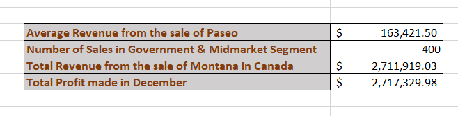
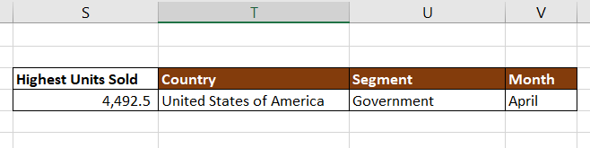
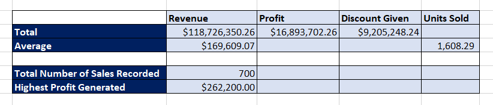

# Auto Body Car Store

## Introduction

This is a Microsoft Excel project on the financial analysis of an imaginary car sales store called **Auto Body Car Store**. Analyzing a car shop's yearly financials is essential for evaluating its performance, making informed decisions, and ensuring long-term sustainability. This process involves a comprehensive assessment of the company's income, expenses, profits, and other financial metrics.

_**Disclaimer_** ⚠️- _All data used for this analysis are hypothetical data generated and do not represent any company's data or an attempt to endanger their performance._

## Problem Statement/Task

1. What is the total revenue and profit generated?
2. What is the average revenue and units sold for every order?
3. What is the total discount and the total number of sales recorded?
4. What is the highest profit generated?
5. What is the average revenue generated from each sale of _Paseo_?
6. What is the number of sales made in the Government and Midmarket segment?
7. What is the total revenue generated from the sales of _Montana_ in Canada?
8. In which Country, Segment and Month was the highest unit of goods sold?
9. What is the total profit made in December?

## Skills Demonstrated

The analysis had demonstrated a range of essential data analysis skills, such as: 
- Data Extraction
- Data Cleaning and Transformation
- Use of Basic Excel Functions (Sum, Average, Count, IF, Min and Max)
- Use of Advanced Functions (VLookup, SumIF and SumIFs, CountIF and CountIFs)

## Analysis

Table 1                               |                    Table 2                        |              Table 3
:------------------------------------:|:-------------------------------------------------:|:--------------------------------------:
                   |                                |            

# Conclusion 

Effective periodic financial analysis is the cornerstone of strategic decision-making for any car shop. By delving into the nuances of revenue streams, expenses, and key financial ratios, the management can gain valuable insights through this analysis. These insights not only help in understanding the current financial health of the shop but also in formulating proactive strategies for sustainable growth and profitability.

